# 🚀 L&T Recruitment Portal

A modern **Recruitment Management System** developed using **Java, JSP, Servlets, JDBC, MySQL, and Bootstrap 5** following the **MVC Architecture**. The portal streamlines the hiring process by providing dedicated modules for **Candidates, Employers, and Administrators**.

---

## 📌 Project Overview

The **L&T Recruitment Portal** is a full-stack web application that enables employers to post jobs, candidates to apply for opportunities, and administrators to manage the complete recruitment ecosystem.

The application is built using Java EE technologies and follows the **Model-View-Controller (MVC)** design pattern with a DAO layer to ensure clean, maintainable, and scalable code.

---

# ✨ Features

## 👨‍💼 Candidate Module

- Candidate Registration
- Secure Login & Logout
- Dashboard
- View Profile
- Edit Profile
- Resume Upload (PDF)
- Resume Viewer
- Browse Jobs
- Search & Filter Jobs
- View Job Details
- Apply for Jobs
- Track My Applications
- View Application Status

---

## 🏢 Employer Module

- Employer Registration
- Secure Login & Logout
- Employer Dashboard
- Post New Jobs
- Edit Job Details
- Delete Jobs
- Manage Posted Jobs
- View Applicants
- View Candidate Resume
- Shortlist Candidates
- Reject Candidates
- Select Candidates

---

## 🛡️ Admin Module

- Secure Admin Login
- Premium Admin Dashboard
- Manage Candidates
- Candidate Details
- View Candidate Resume
- Delete Candidate
- Manage Employers
- Employer Details
- View Employer Jobs
- Delete Employer
- Manage Jobs
- View Job Details
- Edit Jobs
- Activate / Deactivate Jobs
- Delete Jobs
- Reports Dashboard
- CSV Report Export
- Analytics Dashboard

---

# 📊 Reports & Analytics

The Admin Reports module includes:

- Recruitment Statistics
- Candidate Count
- Employer Count
- Job Count
- Application Count
- Application Status Analytics
- Platform Overview
- CSV Export

---

# 🏗️ Project Architecture

The project follows the **MVC Architecture**.

```
               JSP (View)
                    │
                    ▼
          Servlet Controller
                    │
                    ▼
                 DAO Layer
                    │
                    ▼
              MySQL Database
```

---

# 📁 Project Structure

```
src
│
├── main
│   ├── java
│   │
│   └── com.lnt
│       ├── controller
│       ├── dao
│       ├── model
│       └── util
│
└── webapp
    ├── admin
    ├── candidate
    ├── employer
    ├── assets
    └── WEB-INF
```

---

# 💻 Technology Stack

| Technology | Version |
|------------|---------|
| Java | 21+ |
| JSP | Jakarta EE |
| Servlets | Jakarta Servlet API |
| JDBC | MySQL Connector |
| MySQL | 8.x |
| Bootstrap | 5 |
| HTML5 | ✓ |
| CSS3 | ✓ |
| JavaScript | ES6 |
| Apache Tomcat | 10 |
| Maven | Latest |

---

# 🗄️ Database Tables

The application uses the following database tables:

- admins
- candidates
- employers
- jobs
- applications

---

# 📂 Resume Storage

Uploaded resumes are stored securely outside the project directory.

```
C:\RecruitmentPortalUploads\resumes
```

Resume Viewer:

```
/view-resume?file=UUID.pdf
```

---

# 🔐 Security Features

- Session-based Authentication
- Role-based Access Control
- PreparedStatement for SQL Queries
- MVC Architecture
- DAO Pattern
- Secure Resume Access
- Server-side Validation
- Protected Admin Routes
- Protected Employer Routes
- Protected Candidate Routes

---

# 📈 Key Functionalities

### Candidate

✔ Register

✔ Login

✔ Upload Resume

✔ Browse Jobs

✔ Apply Job

✔ Track Applications

---

### Employer

✔ Register

✔ Login

✔ Post Jobs

✔ Edit Jobs

✔ Delete Jobs

✔ Manage Applications

---

### Admin

✔ Dashboard

✔ Manage Candidates

✔ Manage Employers

✔ Manage Jobs

✔ Reports

✔ Analytics

✔ CSV Export

---

# 📸 Screenshots

Add screenshots here after uploading them.

### Candidate Dashboard

```
| Candidate Dashboard | Candidate Profile |
|----------------------|--------------------|
| 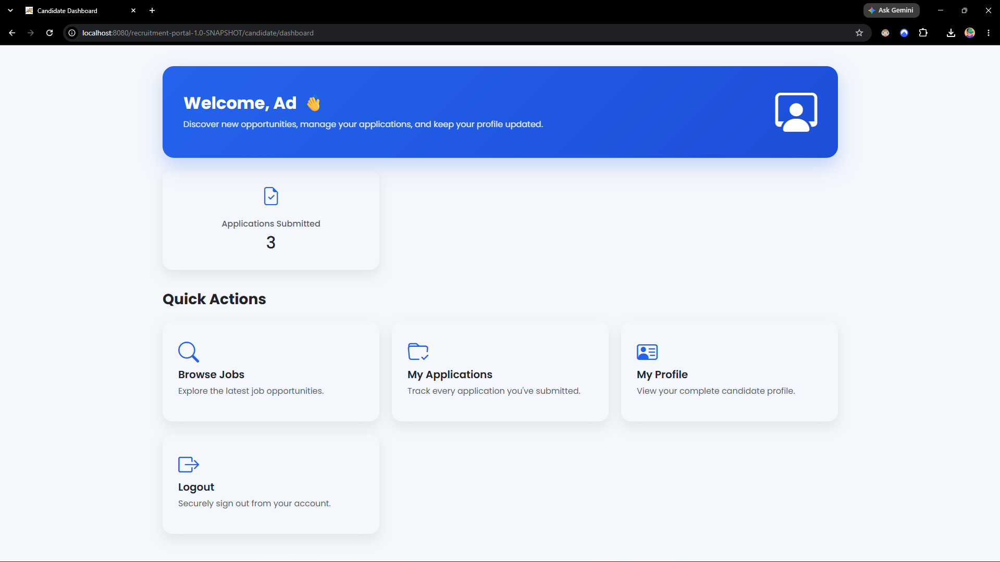 | 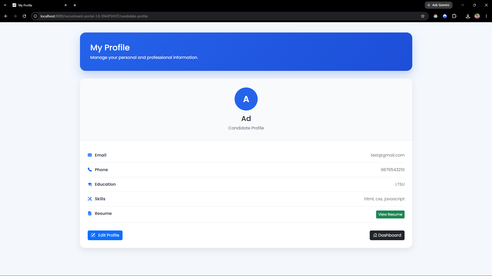 |

| Candidate Jobs | Candidate Applications |
|----------------------|--------------------|
| 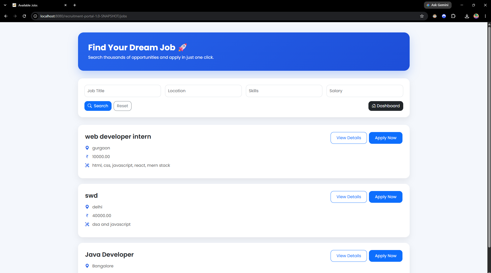 | 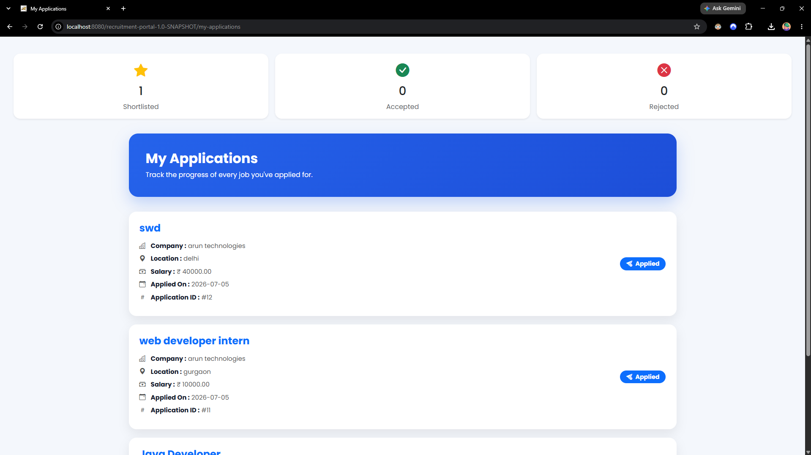 |
```

---

### Employer Dashboard

```
| Employer Dashboard | Employer Managing Jobs | Employer Applications received |
|----------------------|--------------------|--------------------|
| 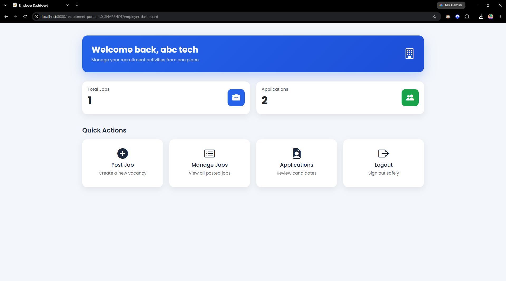 | 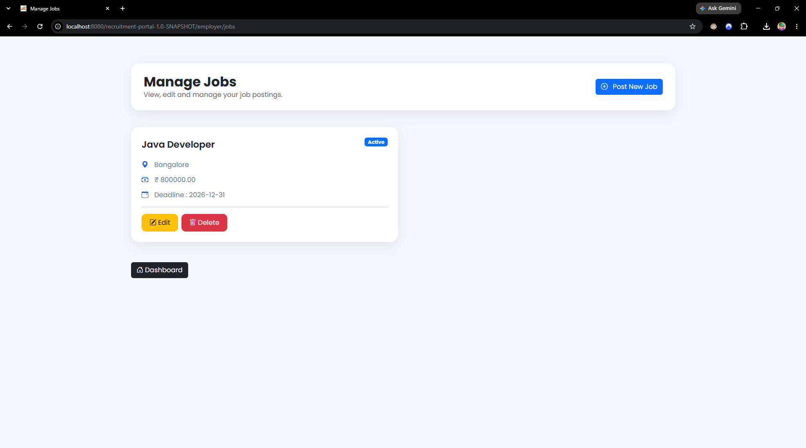 | 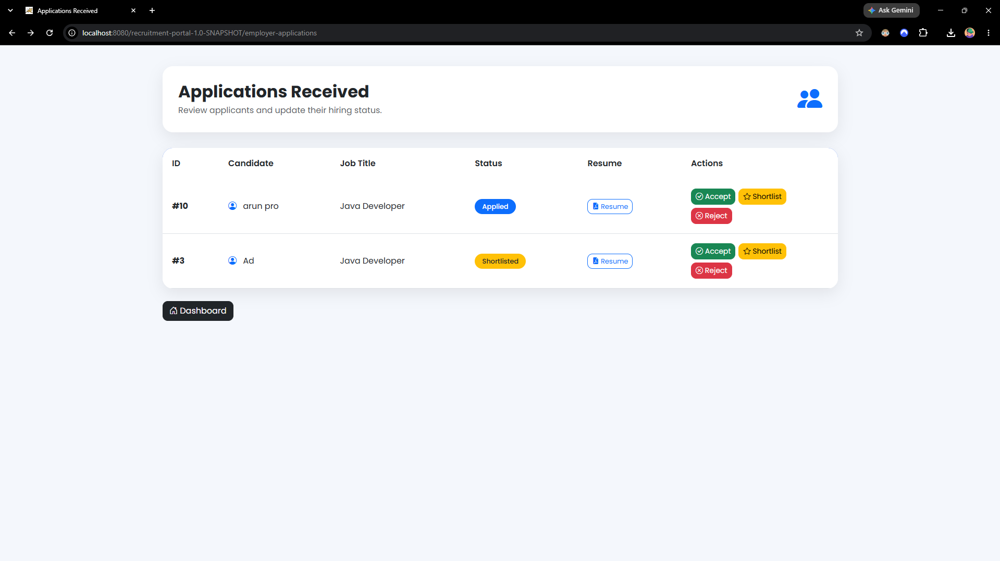 | 
```

---

### Admin Dashboard

```
| Admin Dashboard | Admin Manage Candiadtes |
|----------------------|--------------------|
| 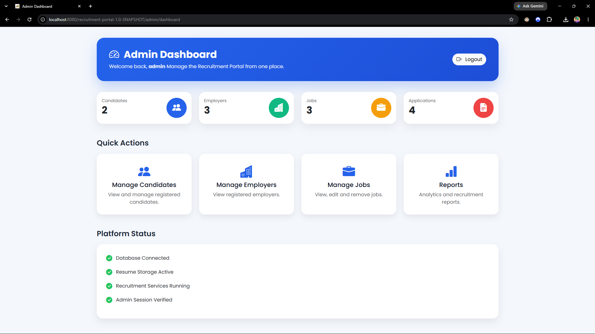 | 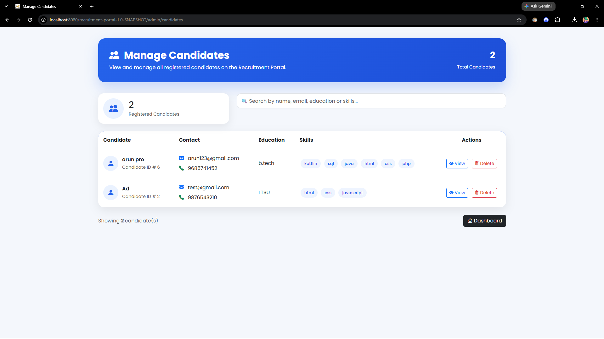 |

| Admin Manage Employers | Admin Reports |
|----------------------|--------------------|
| 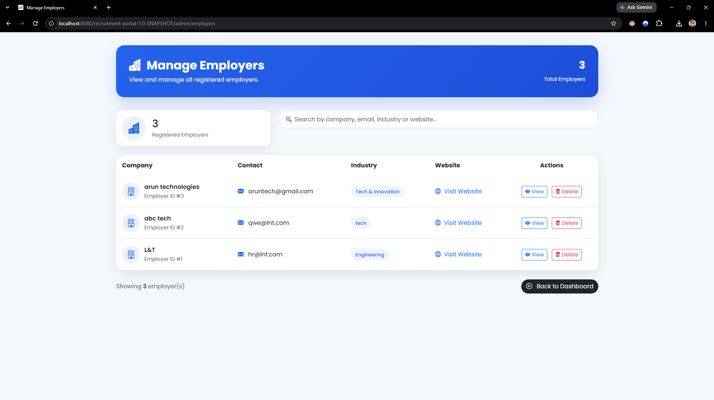 | 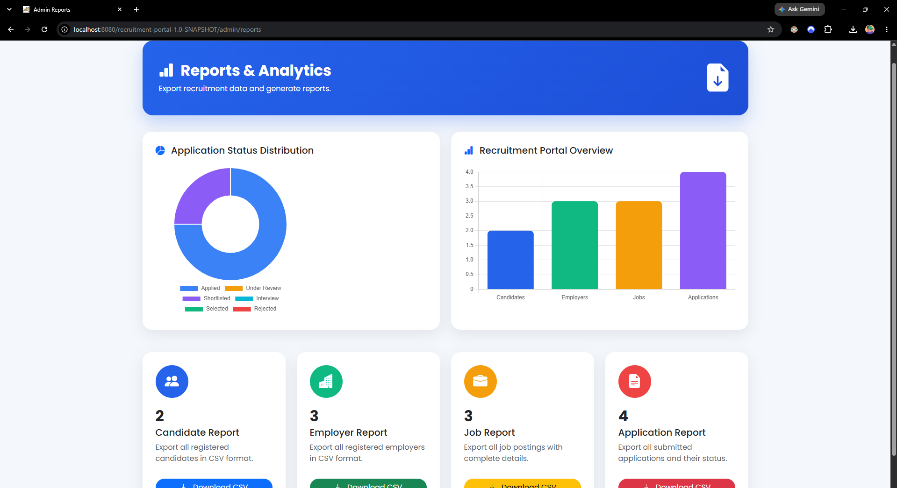 |
```


---

# ⚙️ Installation

## Clone Repository

```bash
git clone https://github.com/Techy-47/LNT-Recruitment-Portal.git
```

---

## Import Project

Import the Maven project into:

- Eclipse IDE
- IntelliJ IDEA
- VS Code

---

## Configure Database

Create a MySQL database.

```
recruitment_portal
```

Import the SQL script.

---

## Configure Tomcat

Use:

```
Apache Tomcat 10
```

---

## Run

```
mvn clean package
```

Deploy the generated WAR file on Tomcat.

---

# 📋 Future Enhancements

- Email Notifications
- Interview Scheduling
- Recruiter Dashboard
- Advanced Analytics
- Pagination
- Job Recommendations
- AI Resume Screening
- OTP Authentication
- Cloud Resume Storage
- REST API Integration

---

# 🎓 Learning Outcomes

This project helped in understanding:

- Java Web Development
- MVC Architecture
- JDBC
- MySQL Database Design
- Session Management
- Authentication & Authorization
- Bootstrap UI Design
- File Upload Handling
- DAO Design Pattern
- Git & GitHub

---

# 👨‍💻 Developed By

**Aditya Raj and team**

B.Tech CSE

---

# ⭐ Support

If you found this project helpful, consider giving it a **⭐ Star** on GitHub.

---

## Thank You ❤️